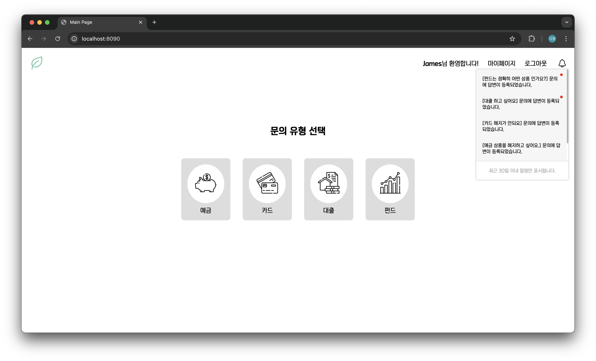
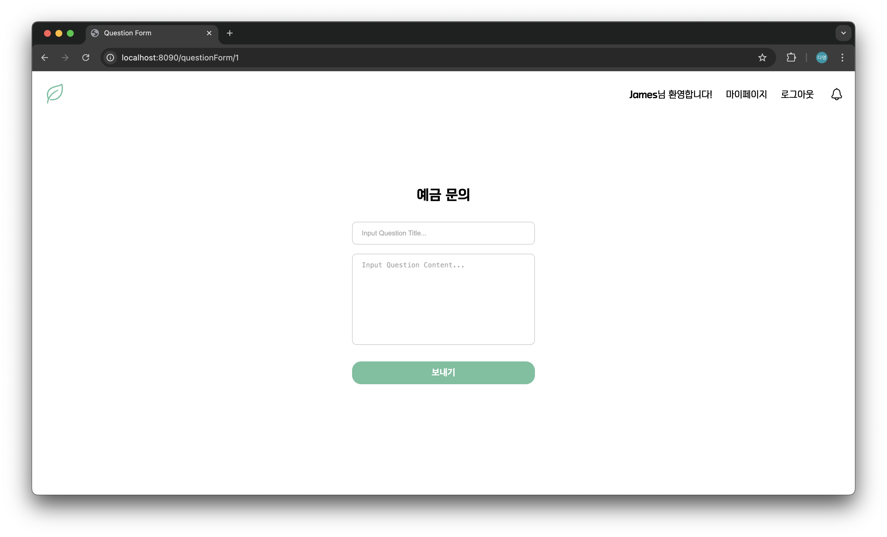
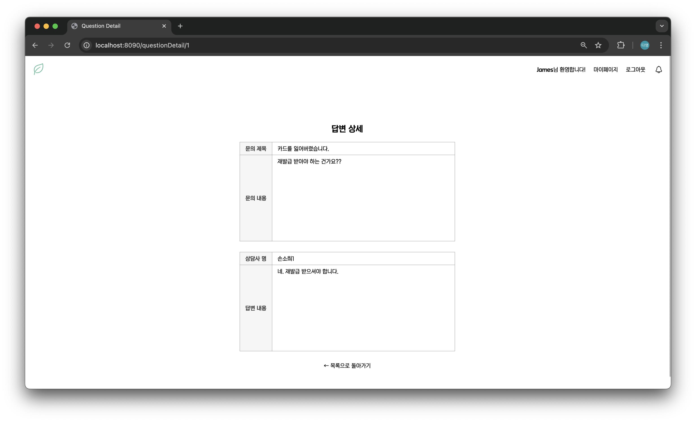
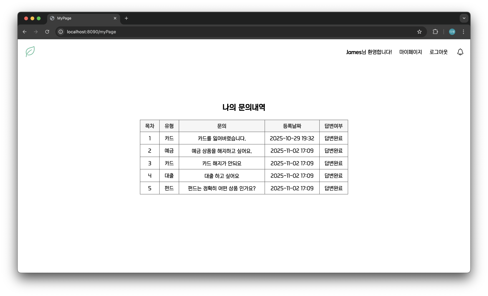
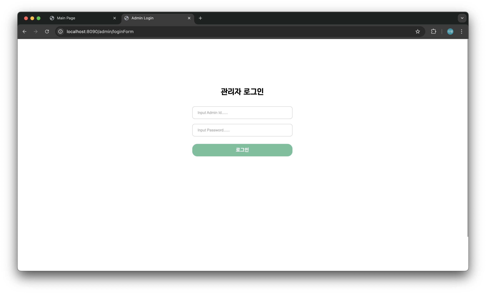
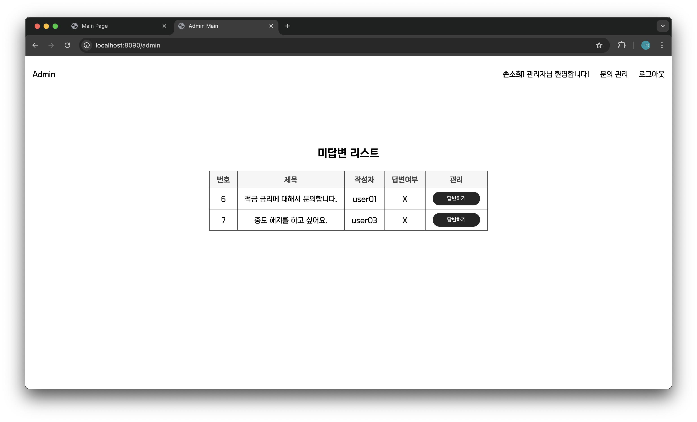
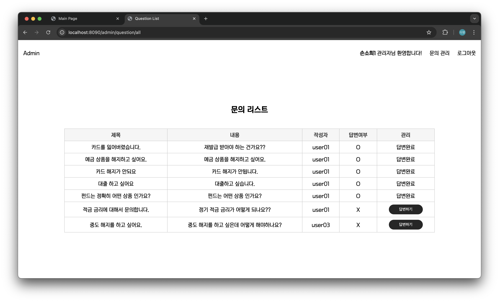
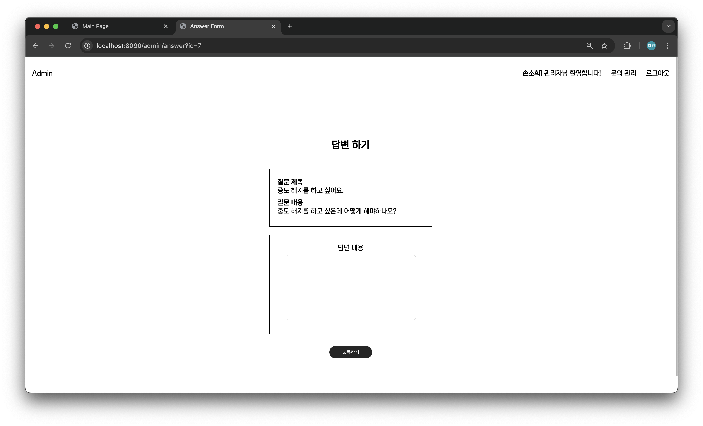
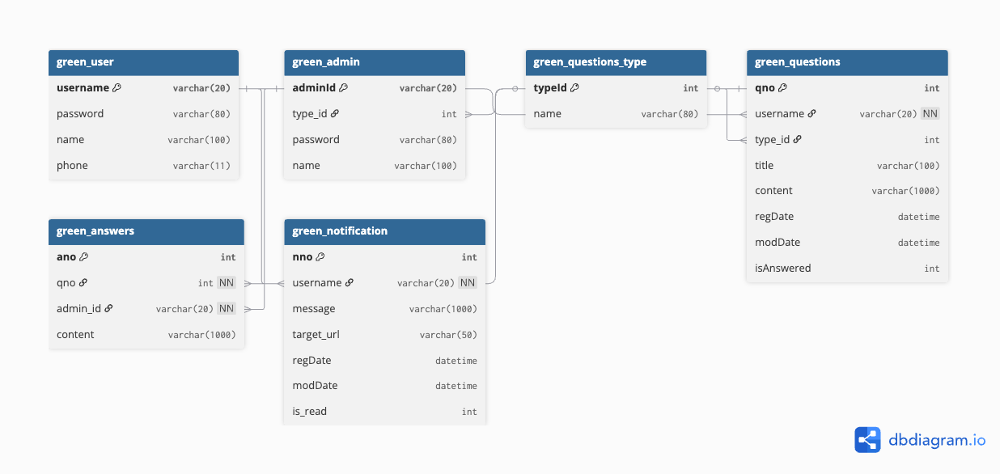

# Green Bank - 금융 상품별 고객 Q&A 페이지

- **유형**: 팀 프로젝트(3인)
- **기간**: 2025.06.20 ~ 2025.06.23
- **개발 환경**: Spring Boot 기반 웹 애플리케이션

## 📌 프로젝트 개요
- 금융 상품(예금, 카드, 대출, 펀드)에 대한 고객 문의 및 관리자 답변 기능 구현
- 사용자 페이지와 관리자 페이지를 구분하여 운영
- 상품 담당자별로 문의를 관리해 업무 효율성 향상
- Custom Filter와 실시간 알림(SSE) 기능을 직접 적용하며 학습 및 구현 경험 축적

## 👥 팀원 소개
| 이름 | 담당 기능 |
| --- | --- |
| &nbsp;&nbsp;&nbsp;&nbsp;손소희&nbsp;&nbsp;&nbsp;&nbsp; | 사용자 메인, 사용자 로그인/회원가입, 관리자 로그인, Custom Filter 구현 |
| &nbsp;&nbsp;&nbsp;&nbsp;윤다영&nbsp;&nbsp;&nbsp;&nbsp; | 사용자 문의 등록/수정/삭제, 사용자 페이지 CSS, 실시간 알림(SSE) 구현 |
| &nbsp;&nbsp;&nbsp;&nbsp;김선엽&nbsp;&nbsp;&nbsp;&nbsp; | 관리자 미답변 문의/전체 문의 조회, 관리자 답변 등록, 관리자 페이지 CSS |

## 🛠️ 기술 스택
- **Back-end**: Java 21, Spring Boot, Spring Data JPA
- **Front-end**: HTML, CSS, JavaScript, Thymeleaf
- **Database**: MariaDB
- **Communication & Tools**: GitHub, Git Desktop, Eclipse

## ✨ 주요 기능
### 사용자
- 로그인 상태에서만 사용자 전용 페이지 접근
- 금융 상품(예금, 카드, 대출, 펀드)별 문의 작성
- '마이페이지'에서 작성한 문의 리스트 조회
- 문의 상세 조회/수정/삭제 기능 제공
- 관리자 답변 등록 시 실시간 알림(SSE) 표시

### 관리자
- 로그인 상태에서만 관리자 전용 페이지 접근
- 담당 상품군의 미답변 문의 리스트 확인
- 문의 상세 조회 및 답변 작성 기능 제공
- '전체 문의 내역'에서 전체 상품 문의 조회
- 답변 등록 시 해당 사용자에게 SSE 이벤트 전송

## 🖥️ 주요 화면
### 사용자
| 메인 | 문의 작성 | 문의 상세 | 마이페이지 |
| --- | --- | --- | --- |
|  |  |  |  |

### 관리자
| 관리자 로그인 | 미답변 리스트 | 전체 문의 | 답변 작성 |
| --- | --- | --- | --- |
|  |  |  |  |

## 📚 DB 설계


> ERD 이미지 원본: [docs/greenbank_erd.png](docs/greenbank_erd.png)

## 📄 기타 문서
- [테이블명세서](docs/greenbank_테이블명세서.xlsx)
- [업무분장표](docs/greenbank_업무분장표.xlsx)
- [와이어프레임](docs/greenbank_와이어프레임.pptx)

## ⚙️ 환경 설정
> 아래 내용을 참고하여 `src/main/resources/application.properties` 파일을 생성한 후 실행해주세요.

```properties
spring.application.name=[your_project_name]

server.port=8090

# Maria DB 설정
spring.datasource.driver-class-name=org.mariadb.jdbc.Driver
spring.datasource.url=jdbc:mariadb://localhost:3306/mydb
spring.datasource.username=[your_db_username]
spring.datasource.password=[your_db_password]

# JPA 설정
spring.jpa.hibernate.ddl-auto=update
spring.jpa.properties.hibernate.format-sql=true
spring.jpa.show-sql=true
```

> 사용자 페이지, 관리자 페이지 접속 링크는 아래를 참고해주세요. 
- 사용자 페이지: [http://localhost:8090](http://localhost:8090)
- 관리자 페이지: [http://localhost:8090/admin](http://localhost:8090/admin)
